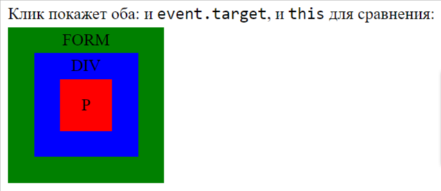

# Событие (Event), target, onsubmit

## Что такое событие (event)?

#### Событие – это сигнал от браузера о том, что что-то произошло. Все DOM-узлы подают такие сигналы (хотя события бывают и не только в DOM). События могут быть инициированы пользователем (например, щелчок мыши, нажатие клавиши) или автоматически (например, загрузка страницы, изменение размера окна). JavaScript позволяет назначать обработчики событий, которые выполняют определенные действия в ответ на возникновение события. Обработчик события - это функция, которая вызывается при наступлении события. Например, вы можете назначить обработчик события "click" для элемента HTML, чтобы выполнить определенные действия при щелчке на этом элементе.

## Чем отличается onclick от addEventListener?

#### onclick и addEventListener - это два различных способа назначения обработчиков событий в JavaScript.

#### **onclick** - это свойство элемента, которое позволяет назначить обработчик события "click" непосредственно на элементе. Однако, следует отметить, что использование onclick имеет некоторые ограничения. Если вы назначаете несколько обработчиков событий "click" на один элемент, только последний назначенный обработчик будет выполняться. Кроме того, при использовании onclick нельзя легко удалить или изменить обработчик события.

#### **addEventListener** - это метод, который позволяет назначать обработчики событий на элементы. Он предоставляет более гибкую и мощную функциональность, чем onclick. Вы можете назначать несколько обработчиков событий на один элемент и легко удалять или изменять обработчики событий. Вы также можете использовать addEventListener для назначения обработчиков других событий, а не только "click":

##### element.addEventListener(event, handler, [options])

##### **event** - Имя события, например "click".

##### **handler** - Ссылка на функцию-обработчик.

##### **options** - Дополнительный объект со свойствами:

##### _once: если true, тогда обработчик будет автоматически удалён после выполнения._

##### _capture: фаза, на которой должен сработать обработчик.Так исторически сложилось, что options может быть false/true, это то же самое, что {capture: false/true}._

##### _passive: если true, то указывает, что обработчик никогда не вызовет preventDefault()._

#### Фундаментальный недостаток описанных выше способов назначения обработчика – невозможность повесить несколько обработчиков на одно событие. Например, одна часть кода хочет при клике на кнопку делать её подсвеченной, а другая – выдавать сообщение.

## Приведите список событий "мыши":

#### click – происходит, когда кликнули на элемент левой кнопкой мыши (на устройствах с сенсорными экранами оно происходит при касании).

#### contextmenu – происходит, когда кликнули на элемент правой кнопкой мыши.

#### mouseover / mouseout – когда мышь наводится на элемент / покидает элемент.

#### mousedown / mouseup – когда нажали / отжали кнопку мыши на элементе.

#### mousemove – при движении мыши.

## Приведите список событий "на элементах управления":

#### submit – пользователь отправил форму <form>.

#### focus – пользователь фокусируется на элементе, например нажимает на <input>.

## Приведите событие "клавиатуры":

#### keydown и keyup – когда пользователь нажимает / отпускает клавишу.

## Приведите событие документа:

#### DOMContentLoaded – когда HTML загружен и обработан, DOM документа полностью построен и доступен.

## Приведите событие CSS:

#### transitionend – когда CSS-анимация завершена.

## Что такое Обработчик события?

#### Это функция, которая вызывается в ответ на возникновение определенного события. Обработчик события определяет, какие действия должны быть выполнены при наступлении события. Обработчик события может содержать код, который выполняет определенные действия, такие как изменение содержимого страницы, отправка данных на сервер, анимация элементов и многое другое.

## Как удалить Обработчик?

#### Для удаления обработчика следует использовать removeEventListener:

##### element.removeEventListener(event, handler, [options]);

##### **Пример 1**

##### function handler() {

##### alert( 'Спасибо!' );

##### }

##### input.addEventListener("click", handler);

##### // ....

##### input.removeEventListener("click", handler);

##### **Пример 2**

##### function handler1() {

##### alert('Спасибо!');

##### };

##### function handler2() {

##### alert('Спасибо ещё раз!');

##### }

##### elem.onclick = () => alert("Привет");

##### elem.addEventListener("click", handler1); // Спасибо!

##### elem.addEventListener("click", handler2); // Спасибо ещё раз!

## Что токое объект события (Object Event)?

#### Объект event в JavaScript представляет информацию о событии, которое произошло веб-странице или веб-приложении. Чтобы хорошо обработать событие, могут понадобиться детали того, что произошло. Не просто «клик» или «нажатие клавиши», а также – какие координаты указателя мыши, какая клавиша нажата и так далее. Когда происходит событие, браузер создаёт объект события, записывает в него детали и передаёт его в качестве аргумента функции-обработчику.

##### Пример ниже демонстрирует получение координат мыши из объекта события:

##### input type="button" value="Нажми меня" id="elem">

##### 

## Что такое event.target?

#### event.target – это «целевой» элемент, на котором произошло событие, в процессе всплытия он неизменен. Например, если стоит только один обработчик form.onclick, то он «поймает» все клики внутри формы. Где бы ни был клик внутри – он всплывёт до элемента <form>, на котором сработает обработчик. При этом внутри обработчика form.onclick:

##### event.target будет содержать ссылку на конкретный элемент внутри формы, на котором произошёл клик.

##### Здесь клик по P выдаст его target (p) и также его this (form), клик по DIV выдаст его target (div) и также его this (form)

## Что такое событие onsubmit?

#### onsubmit - это атрибут события в JavaScript, который используется для определения действий, которые должны быть выполнены при отправке формы. Когда пользователь отправляет форму, например, нажимает кнопку "Отправить", браузер генерирует событие submit. Атрибут onsubmit позволяет вам указать JavaScript-код, который будет выполнен при возникновении этого события.

##### form.onsubmit = (event) => {

##### console.log(event.target["username"]);

##### }

##### атрибут name используется для идентификации элементов формы, а событие onsubmit используется для определения действий, которые должны быть выполнены при отправке формы. Оба этих элемента взаимодействуют, чтобы обеспечить обработку данных формы.

## Что такое метод preventDefault()?

#### event.preventDefault() - это метод JavaScript, который используется для предотвращения выполнения действия по умолчанию, которое обычно происходит при возникновении события. Когда происходит событие, например, щелчок мыши или отправка формы, браузер выполняет определенное действие по умолчанию. Например, при щелчке на ссылку браузер переходит по указанному URL, а при отправке формы страница перезагружается. Однако, иногда вам может потребоваться изменить это поведение и выполнить свои действия. В таких случаях вы можете использовать event.preventDefault() для отмены действия по умолчанию.
